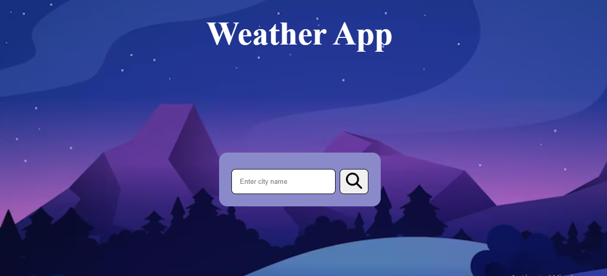
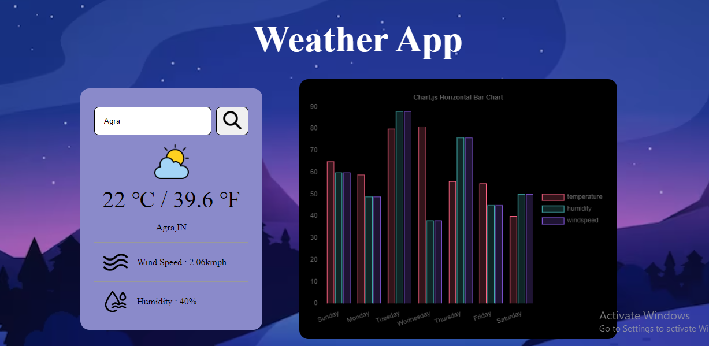

# Weather App using Reactjs

### Features of the app
- On searching a city name, user should get the following data for that particular city :
    - current temp 
    - weather conditions
    - wind speed 

- The app has "recent searches" feature that displays a list of the last five cities that the user has searched for.

- To display the past weather graphically, chartjs is used.

- The app uses OpenWeatherMap API to retrieve the current weather data and visual crossing web service API for retrieving the historical data .
 
- The app is responsive for both both desktop and mobile devices.

-Error handling is being taken care of in case of invalid input or cities that dont exist

# Screenshot

